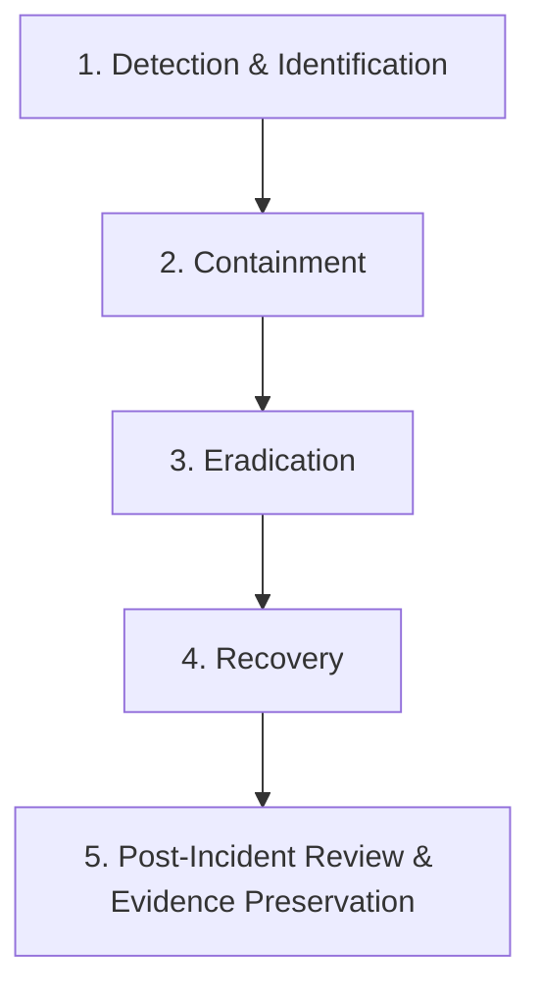

# Media Jungle - Security Incident Response Plan (IRP)
**SOC 2 Compliance Reference**: Control 20 — Security Monitoring and Review  
**Effective Date**: September 2026

---

## 1. Objective & Scope
This incident response plan establishes an actionable protocol for detecting, containing, investigating, and mitigating security incidents across the Media Jungle platform, including unauthorized access attempts, brute-force intrusions, credential compromise, and service disruptions.

---

## 2. Incident Classification & Severity Levels

| Level | Severity | Examples | Target Response Time | Escalation Path |
| :--- | :--- | :--- | :--- | :--- |
| **SEV-1** | Critical | Database breach, leaked private keys, unauthorized admin account creation, active ransomware | $< 15$ Minutes | Lead Security Engineer, CTO, Legal Counsel |
| **SEV-2** | High | Multi-account distributed brute force, token forgery attempt, privilege escalation attempt | $< 1$ Hour | Senior Security Analyst, Lead Backend Engineer |
| **SEV-3** | Medium | Single account lockout surge, suspicious single-source file upload rejections | $< 4$ Hours | Backend Engineering Team |
| **SEV-4** | Low | Isolated input validation failures, expired token attempts | Next Business Day | Normal Support Queue |

---

## 3. Incident Lifecycle Phases



### Phase 1: Detection & Identification
- Automated alerts generated from `audit_log` queries:
  - Repeated `LOGIN_FAILURE` ($\ge 5$ within 5 minutes)
  - `UNAUTHORIZED_ACCESS` events on `/api/v2/admin/**`
  - `BLOCKED_FILE_UPLOAD` events involving executable MIME types
- System logs inspected at `mediajungle.log`.

### Phase 2: Containment
1. **Account Isolation**:
   - Suspend compromised user or staff account:
     ```http
     PATCH /api/v2/admin/registered-user/{id}/status
     { "status": "SUSPENDED" }
     ```
2. **Session Invalidation**:
   - Blacklist active JWT tokens associated with the session via `TokenBlacklist`.
3. **Network Quarantine**:
   - Block malicious source IPs at firewall / reverse proxy level.

### Phase 3: Eradication
1. Review all actions taken by the compromised identity in `audit_log`:
   ```sql
   SELECT timestamp, action, module, request_url, http_method, ip_address, status
   FROM audit_log
   WHERE username = 'suspect_user' AND timestamp >= NOW() - INTERVAL '24 HOURS'
   ORDER BY timestamp DESC;
   ```
2. Revert any unauthorized changes (metadata updates, role modifications).
3. Force password reset and revoke MFA credentials (`POST /api/v2/mfa/admin/reset`).

### Phase 4: Recovery
1. Verify system integrity and database consistency.
2. Reinstate affected user account with `ACTIVE` status and new temporary credentials.
3. Monitor user activity closely for 72 hours post-recovery.

### Phase 5: Post-Incident Review & SOC 2 Evidence Preservation
1. Document root cause analysis (RCA), timeline, and impact assessment.
2. Preserve forensic evidence (`audit_log` records, application logs, packet captures) in tamper-evident storage for $\ge 1$ year for SOC 2 audit inspection.
